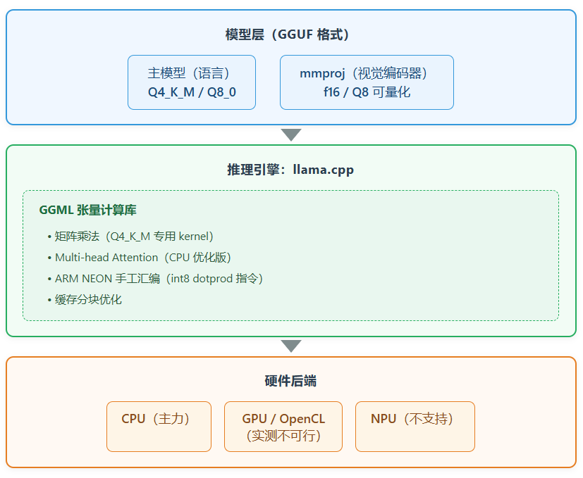
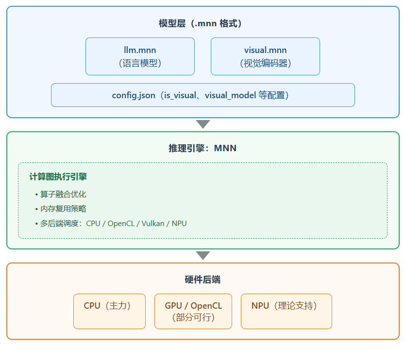
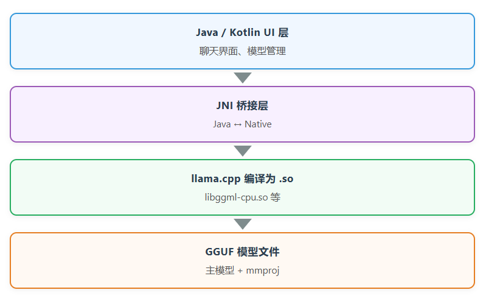
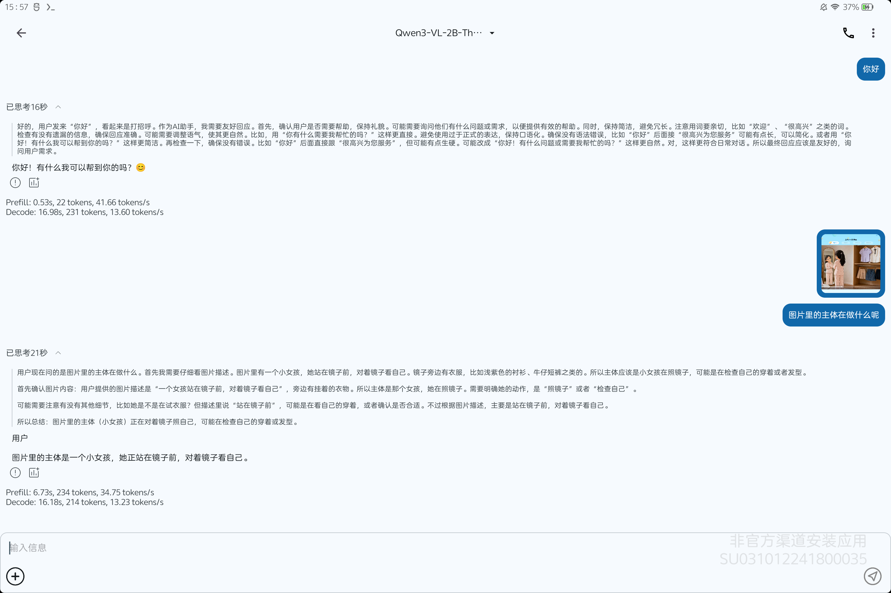
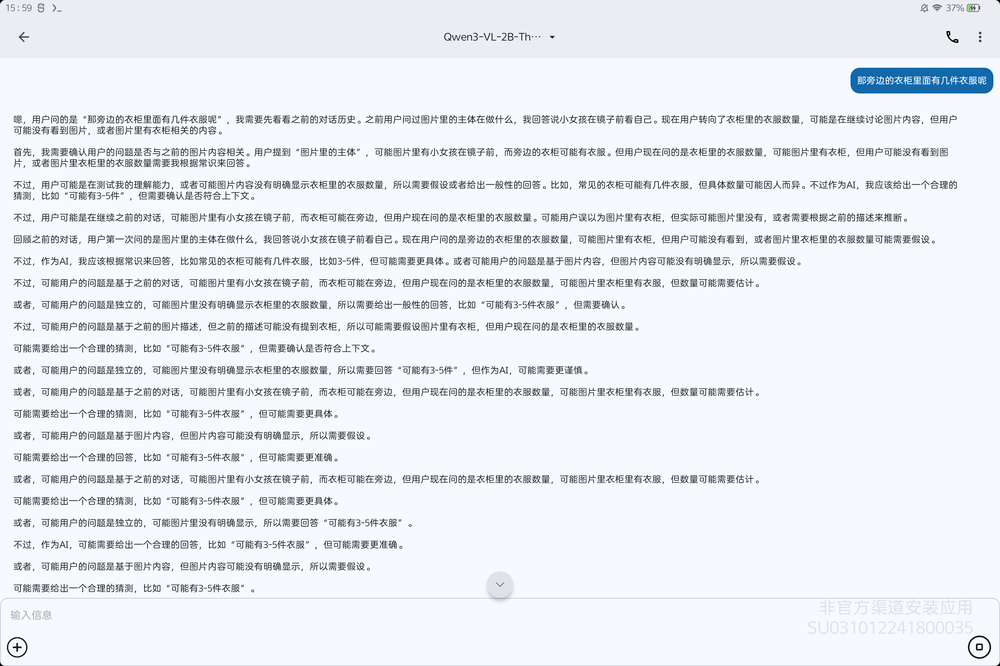
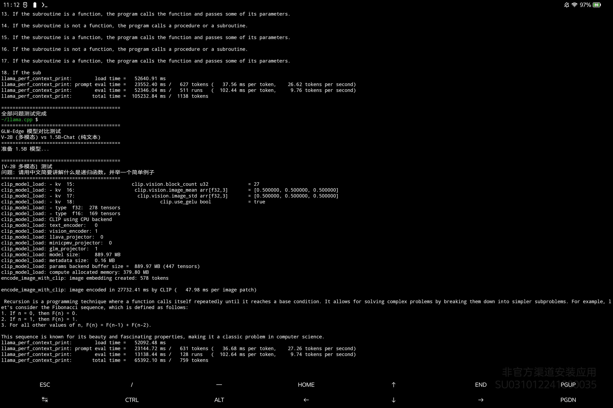
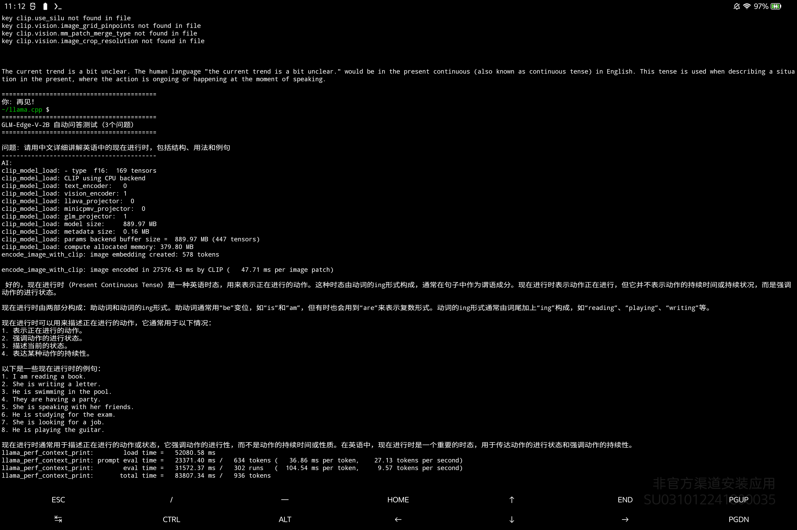
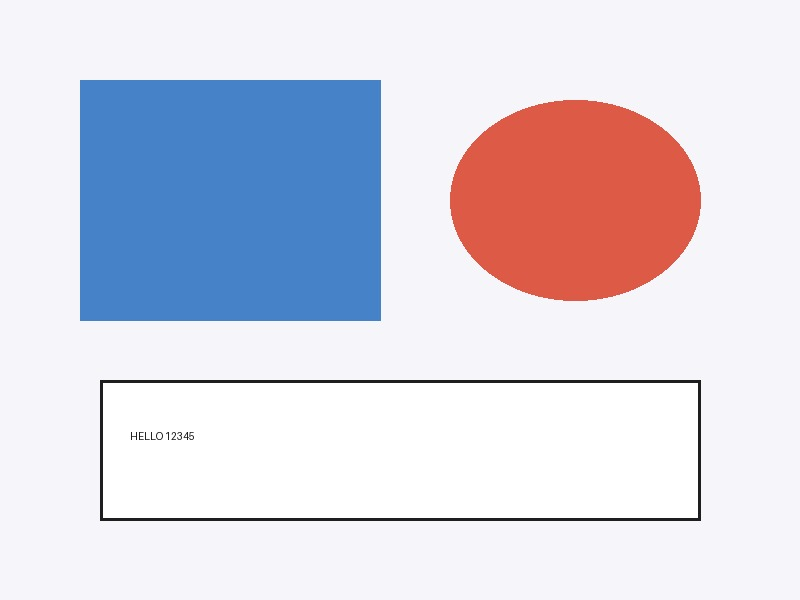
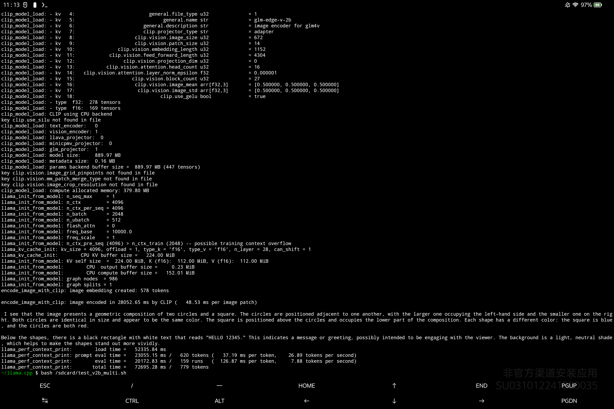
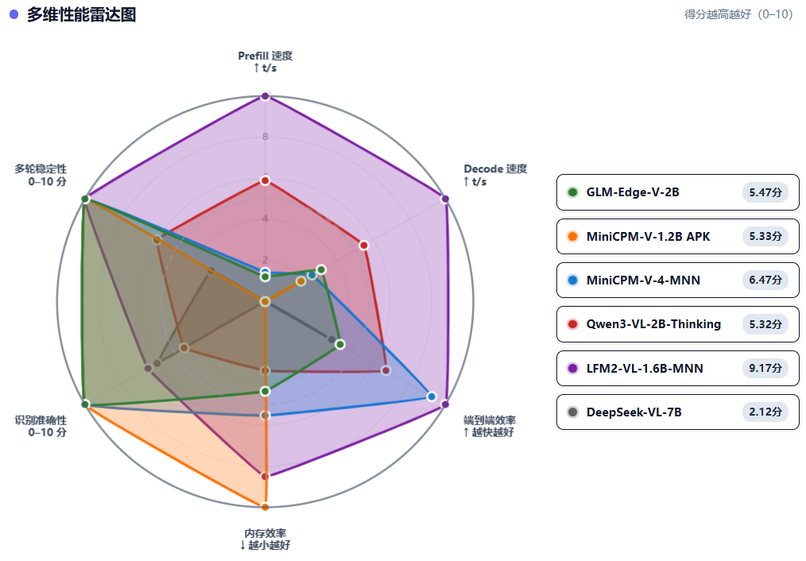

# 离线大模型部署调研报告

> **摘要：**本报告基于RK3588S硬件平台完成离线多模态大模型全量实测：
> 当前安卓端侧国产离线大模型分为两大社区生态：**llama.cpp+GGUF开源**社区资源丰富、模型适配速度快、跨芯片兼容性好；**阿里MNN**生态依托厂商定向合作拥有专属模型包但格式私有化、第三方资源较少，设备内置NPU存在权限与格式壁垒无法使用，Mali GPU实测推理效率低于CPU不具备加速价值；
> 本次调研梳理出三类落地形态：**①** GGUF+llama.cpp原生命令行/服务、**②** MNN推理引擎配套APK、**③** 面壁基于llama.cpp封装的成品APK；
> 调研覆盖**8**家厂商共**31**款国产/海外多模态模型，排除7B以上大参数量、云端API、需Root权限等方案，实测显示仅**面壁智能、智谱AI、深度求索**有模型达到可运行标准，多数厂商模型存在无公开部署包、运行闪退、输出乱码、配置文件缺失等问题；
> 其中仅有 **2** 款模型满足产品可用标准，综合实测时延、内存占用、多轮对话稳定性后，主力推荐智谱**GLM-Edge-V-2B（GGUF+llama.cpp路线）与 面壁MiniCPM-1.2B封装APK**两套方案。

## 一、调研概述

### 1.1 调研背景

#### 1.1.1 需求

计划在硬件平台上部署端侧多模态大语言模型，实现图片理解、视觉问答、多轮对话等 AI 交互能力。

#### 1.1.2 当前痛点

此前已尝试部署面壁 MiniCPM 模型（1B/1.2B）

实际体验中存在以下可复现问题：① 视觉推理响应时间过长：图片理解任务端到端时超出用户可接受范围；② 多轮对话稳定性不足：连续追问场景下偶发输出异常；③部署链路不完整：从模型加载到推理输出的端到端流程存在中断；

**初步判断**：当前体验瓶颈主要来自原生部署配置存在问题，模型选型偏差，并非端侧多模态模型的能力上限。本次调研将在统一硬件环境和测试标准下，对多模态模型的技术可行性与产品可用性进行系统性验证。

#### 1.1.3 硬件约束

本次调研基于 RK3588S 平台（8 核 CPU，12GB 内存，Android 12）完成全部实测工作。核心硬件结论如下：

| 计算单元 | 可用性 | 说明 |
| --- | --- | --- |
| CPU | ✅ 主力计算单元 | ARM NEON 优化充分，实测推理速度满足端侧交互基线 |
| GPU（Mali-G610） | ❌ 实测速度明显慢于CPU，不采用 | OpenCL 实测推理性能低于 CPU，无加速收益 |
| NPU（RKNN，6 TOPS） | ❌ 当前不具备落地条件 | 硬件存在，但多模态模型无成熟适配，软件链路未打通 |

**平台能力边界：**

- RK3588S 可用内存约 8-10GB，实测 7B 参数模型推理速度已明显下降，因此本次调研将参数量 > 7B 的模型排除在实测范围之外

- 本章所有结论基于 RK3588S 平台实测得到，不向其他硬件平台（展锐 T760 等）泛化

### 1.2 调研目标与成功标准

#### 1.2.1 调研目标

本次的调研目标是筛选能在RK3588S上稳定运行的多模态模型，明确可用的推理引擎加模型格式的技术路线，定位当前部署方案的瓶颈，并基于实测数据输出选型建议。

#### 1.2.2 成功标准

| 标准 | 定义 | 状态 |
| --- | --- | --- |
| 工程可运行 | 模型可加载推理、基础功能可触发，但存在多轮异常等可复现缺陷 | ⚠️ 功能残缺通过 |
| 产品可用 | 功能完整、多轮对话稳定、时延满足交互要求 | ✅ 验证通过 |

**P0（必须达成）：**

- 筛选出至少 1 个达到产品可用标准的国产多模态模型

- 明确可落地的技术路线（推理引擎 + 模型格式 + 部署方式）

- 基于实测数据给出明确选型建议

**P1（期望达成）：**

- 定位现有 MiniCPM 部署方案的瓶颈

- 找到 2-3 个备选模型方案

- 完成多维度横向对比

### 1.3 调研方法与评估维度

#### 1.3.1 调研方法

| 渠道 | 用途 |
| --- | --- |
| 厂商官方文档 | 确认模型架构、量化方案、部署指南 |
| 推理引擎文档 | MNN / llama.cpp 部署文档 |
| 社区信息 | GitHub Issues/Discussions、HuggingFace/ModelScope |
| 板端实测（核心） | 实际部署、推理测试、日志分析 |

#### 1.3.2 评估维度

本次调研按以下四个维度记录模型表现，全部观测结果在第四章统一呈现：

| 维度 | 考察内容 |
| --- | --- |
| 识图功能 | 图像识别任务是否能正常完成 |
| 多轮对话稳定性 | 连续追问是否存在乱码、错乱 |
| 推理时延 | 端到端推理耗时 |
| 内存占用 | 运行期间峰值内存 |

### 1.4 调研范围

#### 1.4.1 包含内容

- **模型**：国内主流开源多模态大模型

- **技术栈**：GGUF + llama.cpp、MNN 两套端侧推理技术路线（含对应模型格式与推理引擎）

- **硬件平台**：RK3588S 为主力测试平台

#### 1.4.2 排除内容

| 排除项 | 原因 |
| --- | --- |
| 国际模型（LLaVA 等） | 调研聚焦国产方案 |
| 纯文本模型 | 需求要求多模态 |
| 云端 API 模型 | 需求要求端侧离线 |
| 参数量 > 7B | 7B 在 RK3588S 上已较慢，更大模型不满足本平台可用性预期 |
| GPU 加速方案 | 实测无加速收益 |
| 需 Root 权限方案 | 板子无 Root 权限 |

## 核心结论

**结论一：技术路线**

端侧多模态部署存在两条可用技术路线：GGUF + llama.cpp 和 MNN。两条路线均在 RK3588S 上完成端到端验证，可支撑国产多模态模型的本地推理。

**结论二：模型选型**

本次调研实测 8 个厂商、31 个模型，其中 5 个达到工程可运行标准，2 个达到产品可用标准。

达到产品可用标准的模型为：面壁 MiniCPM-V-4（MNN）、智谱 GLM-Edge-V-2B（GGUF + llama.cpp）。两者均支持图像识别与多轮对话，推理时延在可接受范围内。

**结论三：整体判断**

端侧多模态模型在国产芯片上已实现从不可用到可运行的突破，但距离稳定产品化交付仍有明显距离。多数可运行模型存在时延偏高、多轮对话异常等可复现问题。产品可用性（跑得好）的成熟度仍低于技术可达性（跑得起来）。

## 二、测试环境与基准方法

### 2.1 测试平台

#### 2.1.1 主力测试平台：RK3588S

全部实测工作基于以下硬件平台完成：

| 项 | 规格 | 对推理的影响 |
| --- | --- | --- |
| SoC | 瑞芯微 RK3588S | — |
| CPU | 8核（4×A76 @ 2.4GHz + 4×A55 @ 1.8GHz） | 主力计算单元，ARM NEON 优化充分 |
| 内存 | 12GB LPDDR4X | 可用约 8-10GB，7B 已较慢，>7B 不纳入测试 |
| NPU | RKNN，6 TOPS | 硬件存在，软件链路未打通，本次不采用 |
| GPU | Mali-G610 MP4 | OpenCL 实测无加速收益，本次不采用 |
| 系统 | Android 12 | — |
| 连接方式 | USB 调试（ADB） | — |

#### 2.1.2 硬件能力验证摘要

**CPU**：实测推理速度 9-14 tok/s（文本生成阶段），可支撑端侧交互基线。

**GPU（Mali-G610）**：使用 llama.cpp OpenCL 后端进行验证。实测在图像处理（pp32）场景下，GPU 推理速度（8.59 t/s）低于 CPU 基线（61.76 t/s）；文本生成（tg128）场景下 GPU（6.63 t/s）同样低于 CPU（13.49 t/s）。**结论：Mali GPU 在本平台上无加速收益，本次不采用。**

> 注：llama.cpp OpenCL 后端主要针对高通 Adreno GPU 优化，在 ARM Mali 上执行效率偏低。该结论仅适用于本平台，不向其他 GPU 型号泛化。

**NPU（RKNN）**：硬件规格为 6 TOPS INT8。经验证，当前无多模态模型适配版本，且模型格式（GGUF/MNN）与 RKNN 不兼容，软件链路未打通。**结论：NPU 当前不具备端侧多模态模型落地条件，本次不采用。**

#### 2.1.3 存量平台参考：展锐 UMS9620（T760）

部分前期验证工作在展锐 T760 平台上完成，作为存量机型参考：

| 项 | 规格 |
| --- | --- |
| CPU | 8核（4×A76 @ 2.2GHz + 4×A55 @ 2.0GHz） |
| 内存 | 8GB（实际可用约 3.9GB） |
| NPU | Imagination AURA，1GHz，16 卷积块 |
| GPU | Mali-G57 |
| 系统 | Android 15 |

展锐平台同样验证了 GPU（OpenCL）加速不可行（比 CPU 慢），NPU 通路（libunillmai.so / libimgdnn.so）因普通 App 无权限调用，同样无法使用。后续全部模型选型测试均在 RK3588S 上完成。

### 2.2 软件环境

#### 2.2.1 推理引擎

| 引擎 | 版本/分支 | 部署方式 | 用途 |
| --- | --- | --- | --- |
| llama.cpp | b9637 / piDack 分支（GLM-Edge 适配） | Termux 编译 / ADB 推送 | GGUF 格式模型推理 |
| MNN | MNN Chat 0.8.3（APK） | APK 安装 | MNN 格式模型推理 |

#### 2.2.2 测试工具

| 工具 | 用途 |
| --- | --- |
| ADB | 文件传输、命令执行、日志抓取 |
| logcat | 推理耗时分段计时、异常日志捕获 |
| top / dumpsys meminfo | CPU 占用监控、内存峰值记录 |

### 2.3 评估方法与维度

#### 2.3.1 功能验证流程

每个模型按照以下流程完成功能验证：

| 步骤 | 操作 | 判断标准 |
| --- | --- | --- |
| 1 | 模型加载 | 是否成功加载，无崩溃 |
| 2 | 纯文本对话 | 是否正常输出，无乱码 |
| 3 | 单轮图像识别 | 是否输出与图片内容相关的描述 |
| 4 | 多轮追问（2-3轮） | 是否保持上下文连贯，无乱码/错乱 |

#### 2.3.2 性能记录方法

| 指标 | 记录方式 | 说明 |
| --- | --- | --- |
| 推理时延 | logcat 时间戳差值 | 记录图像编码、文本生成各阶段耗时 |
| 文本生成速度 | logcat token 计数 / 耗时 | 记录 tok/s |
| 内存占用 | `dumpsys meminfo` | 记录运行期间峰值 RSS |

#### 2.3.3 状态判定标准

本章及第四章统一使用以下状态标记：

| 状态标记 | 判定标准 |
| --- | --- |
| ✅ 验证通过 | 功能完整、多轮对话稳定、时延满足端侧交互要求 |
| ⚠️ 功能残缺通过 | 可成功运行，但存在可复现功能缺陷（如多轮乱码、时延偏高） |
| ❌ 运行失败 | 具备可用部署路径，上机出现闪退、卡退、输出异常 |
| ⛔ 无部署通路 | 不存在公开可用的 GGUF/MNN 转换包 |
| 🔶 待验证 | 模型文件已就绪，尚未完成板端推理实测 |
| ❌ 超出硬件约束 | 参数量超出本平台硬件能力边界，不开展测试 |

### 2.4 测试流程

#### 2.4.1 GGUF + llama.cpp 路线测试流程

**环境准备（一次性）**：

- RK3588S 板子安装 Termux

- Termux 内安装编译工具：git、clang、cmake、python

- 克隆 llama.cpp 源码（官方分支或 piDack GLM-Edge 分支）

- 执行 `make -j8` 编译生成 llama-cli / llama-mtmd-cli / llama-server

**单模型测试流程**：

- PC 端下载 GGUF 模型文件（主模型 + mmproj）

- `adb push` 推送到板子 `/data/local/tmp/` 或 `/sdcard/`

- Termux 中执行推理命令，记录输出和日志

- 按功能验证流程逐项测试

- 记录性能数据

#### 2.4.2 MNN 路线测试流程

**环境准备（一次性）**：

- PC 端下载 MNN Chat APK（0.8.3 版本）

- `adb install` 安装到 RK3588S 板子

**单模型测试流程**：

- 在 MNN Chat 模型市场中下载目标模型（.mnn 格式）

- 或 PC 端下载 .mnn 模型文件，`adb push` 到 `/data/local/tmp/mnn_models/`

- 在 MNN Chat 界面中加载模型

- 按功能验证流程逐项测试

- 通过 logcat 抓取性能数据

#### 2.4.3 各类第三方 llama.cpp 安卓 App

MiniCPM APK、PocketPal开包即用

### 2.5 测试数据集

#### 2.5.1 图片测试集

本次测试使用以下类型图片：

| 类型 | 数量 | 用途 |
| --- | --- | --- |
| 自然场景（风景、人物） | 3-5 张 | 图片理解能力验证 |
| 文档/文字图片 | 2-3 张 | OCR 能力验证 |
| 复杂多对象场景 | 2-3 张 | 细粒度识别能力验证 |

> 注：测试图片在模型跑通基本功能后才逐步引入，不干扰“能否跑起来”的判定。

#### 2.5.2 提问模板

| 测试项 | 问题模板 |
| --- | --- |
| 图像描述 | “描述这张图片的内容” |
| 物体识别 | “这张图片里有什么？” |
| 细节识别 | “图片中的XX是什么颜色/形状？” |
| 多轮追问 | 基于前序回答的连续追问（2-3轮） |

### 2.6 测试环境约束

| 约束项 | 说明 |
| --- | --- |
| 网络状态 | 离线运行，不依赖互联网 |
| 电源 | 充电状态，避免功耗限制影响性能 |
| 散热 | 未加主动散热，长时推理可能触发降频 |
| 时间窗口 | 2026年8月3日—8月11日 |

## 三、技术路线分析

### 3.1 总体判断

> 端侧多模态部署目前存在两条可用的推理引擎路线：GGUF + llama.cpp 和 MNN。两条路线均可将模型在 RK3588S 板子上跑通，但各有侧重和局限。

在硬件后端层面，CPU 是当前唯一可靠的计算单元，GPU 在实测中表现不佳（Mali-G57 OpenCL 比 CPU 慢），NPU 硬件存在但软件链路不通，均无法作为当前阶段的主力后端。

### 3.2 推理引擎路线

| 对比维度 | 路线一：GGUF + llama.cpp（原生） | 路线二：MNN 引擎 + MNN Chat APK | 路线三：面壁 MiniCPM-V 自研 APK（llama.cpp 封装） |
| --- | --- | --- | --- |
| 底层核心 | llama.cpp 开源推理框架，GGUF 开放模型格式 | 阿里达摩院自研 MNN 推理引擎，私有.mnn 模型格式 | 底层仍是 llama.cpp+GGUF，外层 Java/Kotlin 封装 UI、JNI 桥接 so 库 |
| 模型生态 | 社区资源极丰富，HF / 魔搭持续产出量化包，新模型适配仅 1-4 周 | 仅魔搭专区提供官方 MNN 模型，依赖厂商定向适配，更新速度中等 | 仅适配面壁自家 MiniCPM 系列模型，无第三方模型支持 |
| 部署门槛 | 中等，需自行编译源码、推送模型到设备 | 低，安装官方 APK 即可一键下载模型 | 低，直接安装成品 APK 开箱即用 |
| 硬件适配 | 纯 CPU 优化，跨 RK / 展锐芯片通用，GPU/NPU 不可用 | CPU 为主，理论支持多硬件后端，当前仅 CPU 稳定 | 仅 CPU 推理，适配 RK3588S 平台，跨芯片兼容性差 |
| 内存 & 速度 | 代表模型 GLM-Edge-V-2B，峰值内存约 1.2GB，文本生成 9-10tok/s | 代表模型 MiniCPM-V-4，识图速度更快，识别精度略低 | MiniCPM-1.2B 内存占用约 990MB，但图像编码时延高达 99.5s |
| 可调试性 | 完全开源，日志完整，算子可修改优化 | 半闭源，底层算子难以自定义调试 | 上层 UI 封闭，仅能使用固定配置，底层调优难度高 |
| 适用场景 | 项目自研集成、多模型轮换、长期迭代开发 | 快速验证、仅使用阿里合作厂商模型 | 快速上线、仅使用面壁自家模型的轻量化场景 |
| 核心短板 | 无现成成品 UI，需自行封装交互层 | 模型包配置文件易缺失，部分版本推理乱码 | 图像识别时延过高，多轮实时交互体验差 |

#### 3.2.1 路线一：GGUF + llama.cpp

**技术架构**

**关键技术特点**

**① GGUF 是开放格式，社区驱动**

GGUF 由 llama.cpp 社区定义和维护，不绑定任何厂商。模型来源最广——Hugging Face、ModelScope 等平台均有社区转换版本，新模型的适配速度通常在 1-4 周内。

**② 纯 CPU 推理，无硬件依赖**

llama.cpp 的设计目标是不依赖任何专用硬件加速器，所有优化都落在 CPU 指令级：

- ARM NEON 指令集（所有 ARM 芯片原生支持）

- 矩阵乘法分块算法（利用 CPU 缓存层次）

- Q4_K_M 量化格式的专用 kernel（手工汇编）

这意味着同一套模型文件可以在 RK3588S、展锐 T760、天玑等不同芯片上运行，无需重新适配。

**③ 多模态通过 mmproj 独立加载**

双文件结构：主模型（语言模型）+ mmproj（视觉编码器投影层）。视觉编码器独立于主模型，可单独量化、单独更新。

**④ 运行时形态**

| 形态 | 说明 |
| --- | --- |
| 命令行（llama-cli / llama-mtmd-cli） | adb shell 或 Termux 中直接执行 |
| HTTP Server（llama-server） | 提供 Web UI，可通过浏览器拖图提问 |
| 嵌入 APK | 厂商将 llama.cpp 编译为 .so 打包（面壁 APK 即为此形态） |

**⑤ 对本项目的意义**

GGUF + llama.cpp 是当前阶段的主力路线。它不依赖 NPU 或 GPU，仅靠 CPU 即可运行；生态最活跃，新模型支持最快；且跨平台一致，在不同芯片间迁移成本低。

#### 3.2.2 路线二：MNN

**技术架构**

**关键技术特点**

**① MNN 是阿里自研引擎**

由阿里巴巴达摩院开发并开源（Apache 2.0），与国内多家模型厂商有深度合作（面壁、阿里、深度求索等），在国内端侧推理生态中占据重要位置。

**② 模型格式与工具链专有**

- 模型需转换为 `.mnn` 格式（通过 MNNConvert 工具，支持 PyTorch/ONNX/TensorFlow 转 MNN）

- 官方提供 MNN Chat APK，内置 ModelScope 模型市场，可直接下载多模态模型

- 模型包结构：`llm.mnn` + `visual.mnn` + `config.json`

**③ 多硬件后端支持**

MNN 的核心设计是支持多种硬件后端：

| 硬件后端 | 支持情况 | 说明 |
| --- | --- | --- |
| **CPU（ARM NEON）** | ✅ 完整支持 | 主力后端，实测可用 |
| **GPU（OpenCL）** | ✅ 支持 | 实测部分模型可切换，但非主要测试方向 |
| **GPU（Vulkan）** | ✅ 支持 | 未实测 |
| **NPU** | ⚠️ 理论支持 | 受限于转换工具和权限，当前通路未打通 |

这意味着 MNN 在架构上具备多后端调度的潜力，但目前实际可用且稳定的主要是 CPU 后端。

**④ 交付形态**

MNN 以 APK 形态交付（MNN Chat），桌面图标点开即用，内置模型市场一键下载，用户门槛较低。

**⑤ 对本项目的意义**

MNN 是另一条已验证可行的路线，与 GGUF+llama.cpp 形成互补。其主要优势在于与国内模型厂商（面壁、阿里、深度求索）的合作关系——这些厂商的多模态模型会优先适配 MNN 格式。但需注意：官方模型包的配置完整性参差不齐，需逐个实测验证。

#### 3.2.3 路线三：面壁自研 APK（路线一的封装形态）

面壁 MiniCPM-V-demo APK 不是一条独立的技术路线，而是 路线一（GGUF + llama.cpp）的产品化封装：

它本质上就是把 llama.cpp 编译成 Android 动态库（.so），用 Java/Kotlin 写了一个 UI 外壳，打包成 APK。技术上仍是 GGUF + llama.cpp 路线，只是以产品化形态交付。

#### 3.2.4 两条路线横向对比

| 维度 | GGUF + llama.cpp | MNN |
| --- | --- | --- |
| **模型格式** | GGUF（开放标准） | .mnn（阿里自研） |
| **推理引擎** | llama.cpp（社区驱动） | MNN（阿里达摩院） |
| **硬件后端** | CPU 为主 | CPU 为主，多后端潜力 |
| **模型生态** | 最广（Hugging Face 社区活跃） | 偏窄（魔搭 MNN 专区为主） |
| **新模型适配速度** | 快（1-4 周） | 中等（依赖厂商转换） |
| **部署门槛** | 中（需编译或找打包 APK） | 低（官方 APK） |
| **工具链成熟度** | ★★★★★（llama-server/bench/quantize） | ★★★☆☆（MNNConvert 等） |
| **透明度** | 高（开源可调试） | 中（部分组件闭源） |
| **典型交付形态** | 命令行 / HTTP Server / 厂商 APK | MNN Chat APK |

### 3.3 硬件后端分析

两条推理引擎路线均可调度不同的硬件后端。以下是各硬件后端在本项目中的可行性评估：

#### 3.3.1 CPU（主力后端）

| 维度 | 评估 |
| --- | --- |
| **可行性** | ✅ 已验证可行 |
| **实测平台** | RK3588S（4×A76 @ 2.4GHz + 4×A55 @ 1.8GHz） |
| **代表模型速度** | 9-14 tok/s（文本生成阶段） |
| **优势** | 无硬件依赖、跨芯片一致、工具链成熟 |
| **局限** | 内存带宽瓶颈（解码阶段受限于 DDR 带宽而非算力） |

两条路线（GGUF+llama.cpp 和 MNN）在 CPU 后端上均已验证可行。llama.cpp 的 ARM NEON 优化深度更深，MNN 在部分模型上表现接近。

#### 3.3.2 GPU（OpenCL）

| 维度 | 评估 |
| --- | --- |
| **可行性** | ⚠️ 部分可行，但非优选 |
| **实测平台** | Mali-G57（展锐 T760）、Mali-G610（RK3588S） |
| **测试结果** | llama.cpp OpenCL 在 Mali-G57 上比 CPU 慢 7 倍 |
| **结论** | Mali 系列 GPU 不适合作为推理加速后端 |

在本次调研中，GPU（OpenCL）后端的表现不佳。llama.cpp 的 OpenCL 实现主要为高通 Adreno GPU 优化，在 ARM Mali GPU 上执行效率低。MNN 的 GPU 后端未做专项测试。

#### 3.3.3 NPU

| 维度 | 评估 |
| --- | --- |
| **可行性** | ❌ 当前不可用 |
| **硬件存在** | ✅ RK3588S 有 RKNN（6 TOPS），展锐 T760 有 Imagination AURA |
| **驱动层** | ✅ 设备节点存在（/dev/vha0），部分驱动已加载 |
| **应用层** | ❌ 普通 App 无权限调用 NPU 库 |
| **模型层** | ❌ 需预编译为专用格式（a16w4），GGUF/Q8_0 不兼容 |
| **结论** | 硬件存在、驱动存在、展锐 SDK 存在，但软件链路不通 |

**展锐 NPU 关键探查结果：**

- `/dev/vha0` 设备节点存在，权限 0666

- `libunillmai.so`（展锐 LLM SDK）存在，依赖 `libimgdnn.so`

- `libimgdnn.so` 不在 `public.libraries.txt` 白名单，普通 App 无法加载

- 模型需 `a16w4` 量化格式，离线编译工具不在设备上

展锐已在 `libunillmai.so` 中实现了三个 LLM 专用 NPU 算子（`MUL_MAT_NNA`、`ATTN_BLOCK_NNA`、`FFN_BLOCK_NNA`），说明其确实在为端侧 LLM 做准备，但当前阶段普通 App 无法使用。

**结论：NPU 路线当前不可用于产品，建议中长期持续关注。**

### 3.4 排除的路线

| 路线 | 排除原因 |
| --- | --- |
| **NCNN** | 无多模态 LLM 模型适配案例 |
| **ONNX Runtime Mobile** | 端侧优化不如专用引擎，国产模型适配少 |
| **TFLite** | 主要面向 CNN，LLM 支持弱 |
| **Transformers.js / MLC-LLM** | 性能不足或编译门槛过高 |

### 3.5 技术路线总结

**两条可用推理引擎路线：**

|   | 路线一 | 路线二 |
| --- | --- | --- |
| 名称 | GGUF + llama.cpp | MNN |
| 状态 | ✅ 已验证可行 | ✅ 已验证可行 |
| 主力硬件后端 | CPU | CPU |
| 推荐场景 | 主力路线，社区生态最广 | 阿里系模型优先选择 |
| 代表交付形态 | 命令行 / llama-server / 厂商 APK | MNN Chat APK |

**CPU**——两条路线均以 CPU 为当前稳定后端，9-14 tok/s 的推理速度在端侧可接受范围。

**NPU**——硬件存在但软件链路不通，当前阶段不可用于产品，建议中长期持续关注展锐/瑞芯微的 NPU 工具链开放进展。

**GPU（OpenCL）**——Mali 平台实测比 CPU 慢，不推荐作为推理加速方案。

## 四、模型选型与实测结果

> **说明：** 本章所有结论基于 RK3588S 安卓板测试环境，不向其他硬件平台泛化。

### 4.1 测试说明

#### 状态标记说明

| 状态标记 | 语义定义 |
| --- | --- |
| ✅ 验证通过 | 模型部署完成，单轮/多轮多模态功能正常，无异常报错 |
| ⚠️ 功能残缺通过 | 可成功运行，但存在可复现功能缺陷（如多轮失效、识图偏差） |
| ❌ 运行失败 | 具备可用部署路径（GGUF/MNN），上机出现闪退、卡退、输出异常 |
| ⛔ 无部署通路 | 不存在公开可用的 GGUF/MNN 转换包，客观不具备上机测试条件 |
| ❌ 超出硬件约束 | 参数量超出本平台硬件能力边界，不开展测试 |

> **技术路径简称对照：**
> **路线一**：GGUF + llama.cpp（含 piDack 分支）
> **路线二**：MNN + MNN Chat
> **路线三**：面壁 APK（llama.cpp 封装）

### 4.2 厂商实测结果

#### 4.2.1 面壁智能（MiniCPM 系列）

| 模型 | 参数量 | 技术路径 | 状态 | 观测事实 |
| --- | --- | --- | --- | --- |
| MiniCPM-V-4（MNN） | ~4B | 路线二：MNN | ✅ 验证通过 | 图像识别任务可正常完成；支持多轮对话；文本输出无乱码；在部分图像识别测试中输出偏差（如识别结果与图片实际内容存在出入） |
| MiniCPM-1B（APK） | 1B | 路线三：面壁 APK | ✅ 验证通过 | 纯文本模型，对话沟通可正常完成 |
| MiniCPM-1.2B（APK） | 1.2B | 路线三：面壁 APK | ✅ 验证通过 | 单轮/多轮图像对话可正常完成；但是交互时存在推理时延 95秒/张情况，超出实时交互可接受范围；日志显示视觉编码器为 f16 精度、线程数为 4同上 |
| MiniCPM-4.1B | 4.1B | 路线三：面壁 APK | ❌ 运行失败 | 应用启动后直接闪退 |

#### 4.2.2 阿里云（Qwen 系列）

| 模型 | 参数量 | 技术路径 | 状态 | 观测事实 |
| --- | --- | --- | --- | --- |
| Qwen3-VL-2B-Thinking-MNN | 2B | 路线二：MNN | ⚠️ 功能残缺通过 | 单轮图像识别输出准确；多轮追问场景下输出乱码，可稳定复现 |
| Qwen3.5-0.8B-Claude-4.6-Opus-Reasoning-Distilled-MNN | 0.8B | 路线二：MNN | ⚠️ 功能残缺通过 | 纯文本对话功能完整，输出流畅无乱码；多模态图像识别精度偏低（部分图片内容识别错误）；多轮追问场景输出错乱 |
| Qwen3-VL-2B-Instruct | 2B | 路线二：MNN | ❌ 运行失败 | 推理输出内容错乱，与输入图片/问题无关，无可用输出 |
| Qwen2-VL-2B-Instruct-MNN | 2B | 路线二：MNN | ❌ 运行失败 | 模型可加载，但图片输入被丢弃，静默回退至纯文本模式；日志显示 All multimodal content failed to load, falling back to text-only mode；检查本地 config.json 文件，缺少 is_visual 字段 |
| Qwen2-VL-7B | 7B | 路线二：MNN | ❌ 运行失败 | 模型加载过程中应用卡死退出 |

> **推测框：** Qwen2-VL-2B-Instruct-MNN 功能残缺推测为MNN的APK本身问题，社区人员仅在旗舰款手机上测试过应用与模型性能，不具备参考价值，git社区中也存在对于APK本身问题以及NPU调用的讨论。

**Qwen3-VL-2B-Thinking-MNN实测case：**

#### 4.2.3 智谱AI（GLM 系列）

| 模型 | 参数量 | 技术路径 | 状态 | 观测事实 |
| --- | --- | --- | --- | --- |
| GLM-Edge-V-2B | 2B | 路线一：GGUF + llama.cpp（piDack 分支）+ mmproj | ✅ 验证通过 | 图像识别任务可正常完成；支持多轮对话；推理时延：图像编码约27秒，文本生成 9-10 tok/s；内存占用峰值约1.2GB |
| GLM-Edge-1.5B-Chat（纯文本） | 1.5B | 路线一：GGUF + llama.cpp（piDack 分支） | ✅ 验证通过 | 纯文本对话功能完整，输出流畅无乱码；作为多模主名单的配套纯文本版本，单独列出 |
| GLM-Edge-V-5B | 5B | 路线一：GGUF + llama.cpp（piDack 分支）+ mmproj | 🔶 待验证 | 模型文件下载中，尚未完成板端推理实测 |
| GLM-Edge-4B-Chat（纯文本） | 4B | 路线一：GGUF + llama.cpp（piDack 分支） | 🔶 待验证 | 模型文件已下载，尚未实测 |
| GLM-4V-9B | 9B | 路线一：GGUF + llama.cpp | ❌ 超出硬件约束 | 参数量 9B，超出本平台实测上限（7B 推理已较慢），不开展测试 |
| GLM-4.1V-9B-Thinking | 9B | 路线一：GGUF + llama.cpp | ❌ 超出硬件约束 | 同上 |
| GLM-4.6V-Flash | 9B | 路线一：GGUF + llama.cpp | ❌ 超出硬件约束 | 同上 |

> **备注：** GLM-Edge-V-5B与GLM-Edge-4B-Chat属于官方给定的PC端侧模型，无安卓端复现示例

**GLM-Edge-V-2B纯文本case：**

**GLM-Edge-V-2B多模理解case：**

#### 4.2.4 深度求索（DeepSeek 系列）

| 模型 | 参数量 | 技术路径 | 状态 | 观测事实 |
| --- | --- | --- | --- | --- |
| DeepSeek-VL-7B-Chat-MNN | 7B | 路线二：MNN | ✅ 验证通过 | 纯文本对话功能完整；多模态图像识别可完成；支持多轮对话；推理速度低于其他验证通过模型，端到端响应时间较长 |
| DeepSeek-VL-1.3B | 1.3B | 无 GGUF / 无 MNN | ⛔ 无部署通路 | 未找到该模型的 GGUF 或 MNN 格式转换包 |
| DeepSeek-VL2-4B/16B | 4B/16B | 无 GGUF / 无 MNN | ⛔ 无部署通路 | 未找到该模型的 GGUF 或 MNN 格式转换包 |

#### 4.2.5 LFM 系列（国际模型，供参考）

| 模型 | 参数量 | 技术路径 | 状态 | 观测事实 |
| --- | --- | --- | --- | --- |
| LFM2-VL-1.6B-MNN | 1.6B | 路线二：MNN | ✅ 验证通过 | 图像识别任务可完成，支持多轮对话；推理速度快于本批次多数模型；图像识别精度偏低（部分图片内容识别错误）。该模型由 Liquid AI 开发，非国产厂商，不作为国产选型主名单候选 |

#### 4.2.6 上海AI实验室（Intern 系列）

| 模型 | 参数量 | 技术路径 | 状态 | 观测事实 |
| --- | --- | --- | --- | --- |
| InternVL2_5-1B-MNN | 1B | 路线二：MNN | ❌ 运行失败 | 推理输出为乱码，无有效内容 |
| InternLM2-1.8B（纯文本） | 1.8B | 无 GGUF / 无 MNN | ⛔ 无部署通路 | 未找到该模型的 GGUF 或 MNN 格式转换包 |
| InternLM3-8B（纯文本） | 8B | 无 GGUF / 无 MNN | ⛔ 无部署通路 | 同上 |
| InternVL2-2B | 2B | 无 GGUF / 无 MNN | ⛔ 无部署通路 | 同上 |
| InternVL2-4B | 4B | 无 GGUF / 无 MNN | ⛔ 无部署通路 | 同上 |

#### 4.2.7 零一万物（Yi 系列）

| 模型 | 参数量 | 技术路径 | 状态 | 观测事实 |
| --- | --- | --- | --- | --- |
| Yi-1.5-6B/9B（纯文本） | 6B/9B | 无 GGUF | ⛔ 无部署通路 | 未找到 GGUF 格式转换包 |
| Yi-VL-6B | 6B | 无 GGUF | ⛔ 无部署通路 | 未找到 GGUF 格式转换包 |
| Yi-VL-34B | 34B | 无 GGUF | ⛔ 无部署通路 | 未找到 GGUF 格式转换包 |

#### 4.2.8 北京智源（Aquila 系列）

| 模型 | 参数量 | 技术路径 | 状态 | 观测事实 |
| --- | --- | --- | --- | --- |
| Aquila2-7B（纯文本） | 7B | 无 GGUF | ⛔ 无部署通路 | 未找到 GGUF 格式转换包 |
| Aquila2-VL-7B | 7B | 无 GGUF | ⛔ 无部署通路 | 未找到 GGUF 格式转换包 |

#### 4.2.9 SmolVLM 系列（国际模型，验证视频理解可行性，供参考）

| 模型 | 参数量 | 技术路径 | 状态 | 观测事实 |
| --- | --- | --- | --- | --- |
| SmolVLM-500M-Instruct-MNN | 0.5B | 路线二：MNN | ❌ 运行失败 | 多模态推理无有效输出 |
| SmolVLM2-256M-Video-Instruct-MNN | 0.25B | 路线二：MNN | ❌ 运行失败 | 视频理解推理无有效输出 |

### 4.3 实测结果(数据)

本次测试过程中，5款模型验证通过，2款模型功能残缺通过；

| 状态 | 数量 | 模型 |
| --- | --- | --- |
| ✅ 验证通过 | 5 | 面壁 MiniCPM-V-4（MNN）、面壁 MiniCPM-1.2B（APK）、智谱 GLM-Edge-V-2B、深度求索 DeepSeek-VL-7B-Chat-MNN、LFM2-VL-1.6B-MNN |
| ⚠️ 功能残缺通过 | 2 | 阿里 Qwen3-VL-2B-Thinking-MNN（多轮追问输出乱码）、阿里 Qwen3.5-0.8B-Distilled-MNN（识图精度偏低，追问错乱） |

**下图展示本次实测过程中比较具备代表性的6款模型的综合表现**

#### 表 1：原始裸数据表

| 模型 | 路线 | 参数量 | Prefill 速度 (t/s) | Decode 速度 (t/s) | 图像端到端 (s) | 峰值 PSS (GB) | 稳态 PSS (GB) | OCR 准确性 | 回答准确性 | 稳定性 | 综合评价 |
| --- | --- | --- | --- | --- | --- | --- | --- | --- | --- | --- | --- |
| GLM‑Edge‑V‑2B | llama.cpp | 1.59B | 26.94 | 9.13 | 74.5 | 3.5* | - | 准确 | 准确 | 稳定 | 速度中等，OCR 和回答质量高，多轮表现一致性好，内存占用未测但推算 > 1.6GB |
| MiniCPM‑V‑1.2B APK | llama.cpp 封装 | 752M | 17.3* | 7.5 | 123 | 0.97 | - | 准确 | 准确 | 稳定 | 内存占用最低，适合内存受限场景；速度最慢（是 MNN 版 8 倍），但准确性和稳定性有保障 |
| MiniCPM‑V‑4‑MNN | MNN | 未知 | 28.6 | 8.4 | 15.3 | 2.98 | 2.74 | 准确 | 准确 | 稳定 | 速度快、准确性高、稳定性好三者兼得；内存 2.98GB 在 RK3588S 可接受，在 T760（可用 3.9GB）有一定余量；prefill 随负载自适应加速，decode 多轮退化仅 4.7% |
| Qwen3‑VL‑2B‑Thinking | MNN | 2B | 63.9 | 12.6 | 45 | 3.95 | 3.47 | 不准确 | 较准确 | 较稳定 | 引擎速度最快但 thinking 模式生成 3‑4 倍冗余 token 导致端到端反而慢；OCR 错误率高（漏词 + 数字错）；内存占用最高，在 T760 上余量不足；不适合本场景 |
| LFM2‑VL‑1.6B‑MNN | MNN | 1.6B | 96.4 | 19.2 | 6.5 | 1.64 | 1.48 | 不准确 | 准确 | 稳定 | 引擎性能最强（prefill 是 MiniCPM‑MNN 的 3.4 倍，decode 是 2.3 倍），端到端最快；内存仅 1.64GB 仅次于 APK；但 OCR 有明显错误（漏词 + 数字识别错），不适合需要 OCR 的场景 |
| DeepSeek‑VL‑7B | MNN | 7B | 17.3 | 4.6 | 80* | 5.46 | 4.59 | 较准确 | 较准确 | 不稳定 | 基本可用；内存 5.46GB 超出 T760 可用范围（3.9GB），仅适合大内存设备；decode 速度最慢（4.6 t/s），稳定性差 |

注释：

- 标记为估算值

- GLM 峰值 PSS：基于 1.59B 参数量和 CLIP 未量化推算为 3.5GB

- MiniCPM‑APK Prefill：无 timings 输出，保守估算为实测最低值 17.3 t/s

- DeepSeek 端到端：因只输出 2‑9 个 token，按完整对话估算为 80s

- 测试环境：RK3588S 12GB，Android（iFLY 定制 ROM），2026‑08‑11

- 测试图：几何图形（蓝色正方形 + 红色圆形 + 白色矩形）+ OCR 文本 "HELLO, I am 12345"

#### 表 2：归一化数据表（0‑10 分制）

| 模型 | Prefill 分 | Decode 分 | 端到端分 | 内存分 | 识别准确性分 | 稳定性分 | 综合均分 |
| --- | --- | --- | --- | --- | --- | --- | --- |
| GLM‑Edge‑V‑2B | 1.21 | 3.11 | 4.16 | 4.36 | 10 | 10 | 5.47 |
| MiniCPM‑V‑1.2B APK | 0 | 1.99 | 0 | 10 | 10 | 10 | 5.33 |
| MiniCPM‑V‑4‑MNN | 1.43 | 2.6 | 9.24 | 5.54 | 10 | 10 | 6.47 |
| Qwen3‑VL‑2B‑Thinking | 5.89 | 5.48 | 6.7 | 3.36 | 4.5 | 6 | 5.32 |
| LFM2‑VL‑1.6B‑MNN | 10 | 10 | 10 | 8.51 | 6.5 | 10 | 9.17 |
| DeepSeek‑VL‑7B | 0 | 0 | 3.69 | 0 | 6 | 3 | 2.12 |

##### 归一化口径说明

- 数值指标归一化（Min‑Max 标准化）

正向指标（越大越好） 适用维度：Prefill 速度、Decode 速度 公式：归一化分 = (实测值 - 最小值) / (最大值 - 最小值) × 10

示例（Prefill 速度）： 最小值：17.3 t/s（MiniCPM‑APK / DeepSeek） 最大值：96.4 t/s（LFM2） GLM 得分：(26.94 - 17.3) / (96.4 - 17.3) × 10 = 1.21 分 LFM2 得分：(96.4 - 17.3) / (96.4 - 17.3) × 10 = 10 分

反向指标（越小越好） 适用维度：图像端到端时长、内存占用 公式：归一化分 = (最大值 - 实测值) / (最大值 - 最小值) × 10

示例（内存占用）： 最小值：0.97 GB（MiniCPM‑APK） 最大值：5.46 GB（DeepSeek） MiniCPM‑APK 得分：(5.46 - 0.97) / (5.46 - 0.97) × 10 = 10 分 DeepSeek 得分：(5.46 - 5.46) / (5.46 - 0.97) × 10 = 0 分

- 定性指标量化（专家评分映射）

**OCR 准确性**

- 准确（完全正确识别 "HELLO, I am 12345"）→ 10 分 GLM‑Edge‑V‑2B、MiniCPM‑V‑1.2B APK、MiniCPM‑V‑4‑MNN

- 较准确（主要内容正确，局部错误）→ 6 分 DeepSeek‑VL‑7B（基本准确估算）

- 不准确（明显错误：漏词、数字错）→ 3 分 Qwen3‑VL‑2B‑Thinking（"HELLO! 346"）；LFM2‑VL‑1.6B‑MNN（"HELLO12346"）

**回答准确性**

- 准确（多类问题全部正确）→ 10 分

- 较准确（大部分正确，偶有错误或冗余）→ 6 分

- 不准确（频繁错误或无法回答）→ 3 分

识别准确性分（OCR + 回答准确性平均） 公式：识别准确性分 = (OCR 分 + 回答分) / 2

示例： MiniCPM‑V‑4‑MNN：(10 + 10) / 2 = 10 分 Qwen3‑VL‑2B‑Thinking：(3 + 6) / 2 = 4.5 分 LFM2‑VL‑1.6B‑MNN：(3 + 10) / 2 = 6.5 分

**稳定性**

- 稳定（多轮性能波动 < 10%，无异常）→ 10 分

- 较稳定（波动 10‑30%，或偶发异常）→ 6 分

- 不稳定（波动 > 30%，或频繁失败）→ 3 分

- **综合均分计算**

公式：综合均分 = (Prefill 分 + Decode 分 + 端到端分 + 内存分 + 识别准确性分 + 稳定性分) / 6

示例： MiniCPM‑V‑4‑MNN：(1.43 + 2.60 + 9.24 + 5.54 + 10 + 10) / 6 = 6.47 分 LFM2‑VL‑1.6B‑MNN：(10 + 10 + 10 + 8.51 + 6.5 + 10) / 6 = 9.17 分

**关键说明**

- 归一化目的：将不同量纲的指标（t/s、秒、GB、定性评价）统一到 0‑10 分制，便于可视化对比

- 权重设计：6 个维度等权重（各占 1/6），反映性能与质量并重的评价体系

- 保守估算原则：

- 缺失值使用最差值估算（如 GLM 内存）

- 异常值使用合理推算（如 DeepSeek 端到端）

- 确保对比公平性

- 定性指标量化依据：基于实测案例数量、错误类型、波动幅度的专家评分

### 4.4 关键发现

**发现一：验证通过的模型集中在三家厂商**

在本次被测样本集合中，✅验证通过的模型集中于面壁智能、智谱AI、深度求索三家。其余厂商样本大多存在 ❌运行失败 或 ⛔无部署通路 问题。

**发现二：两条技术路线均已有验证通过样本**

路线一（GGUF + llama.cpp）和路线二（MNN）均有样本达成 ✅验证通过 状态。路线三（面壁 APK）作为路线一的封装形态，效果良好，返回准确，但是多模应用时延问题突出。

**发现三：“验证通过”不等于“满足产品使用需求”**

本次调研中 ✅验证通过 的模型共 5 个，但其中部分模型存在端侧推理时延明显偏高的问题，在多轮追问场景下输出异常（阿里 Qwen3 系列）。实测说明：

> **“可观测现象”表明：当前端侧多模态模型在完整跑通方面已有进展，但距离稳定的产品化交付仍有较大差距。**

**发现四：厂商模型包离散度较高**

同一厂商不同模型包在本次实测中表现差异较大。阿里云样本中，部分版本存在 config 配置缺失（Qwen2-VL-2B-MNN 缺 `is_visual` 字段），部分版本输出错乱（Qwen3-VL-2B-Instruct），部分版本运行正常但追问受限（Qwen3-VL-2B-Thinking-MNN）。当前阶段，同一厂商的不同版本之间无法通过品牌做质量预判，需逐版本实测验证。

### 4.5 关键不确定性说明

本章涉及的异常现象（闪退、卡退、乱码、输出错乱），均未做堆栈分析或代码级定位。因此，以下问题当前处于 **“可复现但未知根因”** 状态，暂无法确认是模型权重、转换包、推理引擎版本还是平台适配带来的问题：

- 面壁 4.1B / V-2.6 的闪退

- 阿里 Qwen3-VL-2B-Instruct 的输出错乱

- 阿里 Qwen2-VL-7B 的卡退

- InternVL2_5-1B-MNN 和 SmolVLM 系列的乱码

## 五、结论与建议

### 5.1 核心结论

#### 5.1.1 技术路线结论

端侧多模态部署存在两条可用技术路线：

| 路线 | 状态 | 说明 |
| --- | --- | --- |
| **GGUF + llama.cpp** | ✅ 已验证可行 | 可控性高，社区生态活跃，可自行适配 |
| **MNN** | ✅ 已验证可行 | APK 开箱即用，部分转换包质量参差，需逐版本验证 |

**GPU、NPU 在当前平台不具备加速条件，不纳入推荐方案。**

#### 5.1.2 模型选型结论

本次调研实测 8 个厂商、31 个模型：

| 类别 | 模型 | 关键观测 |
| --- | --- | --- |
| **主力推荐** | 面壁 **MiniCPM-1.2B（APK）** 智谱 **GLM-Edge-V-2B+1.5B** | 功能完整，多轮稳定 |
| **备选推荐** | 面壁 MiniCPM-V-4（MNN） | 功能完整，识图精度略低，速度略快 |
| **配套纯文本** | 智谱 GLM-Edge-1.5B-Chat | 轻量，纯文本场景专用 |
| **有条件可用** | 深度求索 DeepSeek-VL-7B-Chat-MNN | 功能完整，推理速度较慢 |

#### 5.1.3 整体判断

- **技术可达性**：31 个模型中 5 个达到工程可运行标准，证明端侧多模态“能跑起来”

- **可用可达性**：仅 2 个达到产品可用标准（功能完整 + 时延可接受 + 多轮稳定）

- **关键瓶颈**：失败原因集中在转换包质量、配置完整性、平台适配，非模型能力上限

### 5.2 选型建议

#### 5.2.1 主力推荐

| 项 | 推荐内容 |   |
| --- | --- | --- |
| 模型 | 智谱 GLM-Edge-V-2B（GGUF + llama.cpp，piDack 分支） | 面壁 **MiniCPM-1.2B（APK）** |
| 技术路线 | GGUF + llama.cpp | GGUF + llama.cpp + 自研封装APK |
| 参数量 | 1.59B | 1.2B (实测为0.75B) |
| 内存占用 | ~1.2GB | ~990MB |
| 推理速度 | 图像编码 27s，生成 9-10 tok/s | 图像编码 99.5s，生成 23.7s |
| 推荐理由 | 功能完整（识图+多轮+中文），内存低，技术路线可控 | 功能完整，输出内容准确，有较成熟的落地APK |
| 部署形态 | 可命令行运行（Termux），可嵌入 APK 封装交付。 | 具备比较成熟的APK |
| 不足 | 无成熟落地APK | 多模时延问题突出 |

#### 5.2.2 备选推荐

| 场景 | 推荐模型 | 说明 |
| --- | --- | --- |
| 对速度要求更高、精度要求更低 | 面壁 MiniCPM-V-4（MNN） | 识图精度略低，速度略快，APK 开箱即用 |
| 纯文本对话（无图像输入） | 智谱 GLM-Edge-1.5B-Chat | 轻量快速，与 V-2B 共用技术栈 |

### 5.3 适用边界与局限性

#### 5.3.1 结论适用范围

| 边界 | 说明 |
| --- | --- |
| 平台 | 仅适用于 RK3588S（12GB 内存），不向展锐 T760 等其他平台泛化 |
| 内存 | 可用 8-10GB，7B 为实测上限 |
| 计算单元 | CPU 为主力，GPU/NPU 不采用 |
| 模型范围 | 仅覆盖本次实测的 31 个模型 |

#### 5.3.2 展锐平台说明

展锐 T760（8GB / 实际可用约 4GB）在本次调研中仅做前期验证参考，不作为主力测试平台。GLM-Edge-V-2B（~1.2GB）等低内存模型理论上可移植，但未在展锐平台实测验证。如需在展锐平台部署，需重新实测确认可用性。

#### 5.3.3 未定位的异常

以下异常均未做根因分析，状态为“可复现但未知根因”：

- 面壁 4.1B / V-2.6 APK：启动闪退

- 阿里 Qwen2-VL-7B：卡退

- 阿里 Qwen3-VL-2B-Instruct：输出错乱

- InternVL2_5-1B-MNN：输出乱码

- SmolVLM 两个模型：无有效输出

### 5.4 后续验证方向

| 验证方向 | 说明 |
| --- | --- |
| GLM-Edge-V-5B 实测 | 5B 参数量，理论上精度更高，需验证性能是否仍可接受 |
| Qwen2-VL-2B（GGUF 版）实测 | 工具链已跑通，模型已推板子，可直接实测 |
| 最优线程数调优 | 当前使用默认 4 线程，可尝试 2/6/8 线程寻找最优配置 |
| mmproj 量化对比 | 当前 f16 精度，量化到 Q8 后的速度与精度对比 |
| NPU 工具链生态跟踪 | 展锐 / 瑞芯微 NPU SDK 如有更新，可重新评估 |
| 已失败模型根因定位 | 闪退/卡退/乱码，如需推进产品化可补充定位 |
